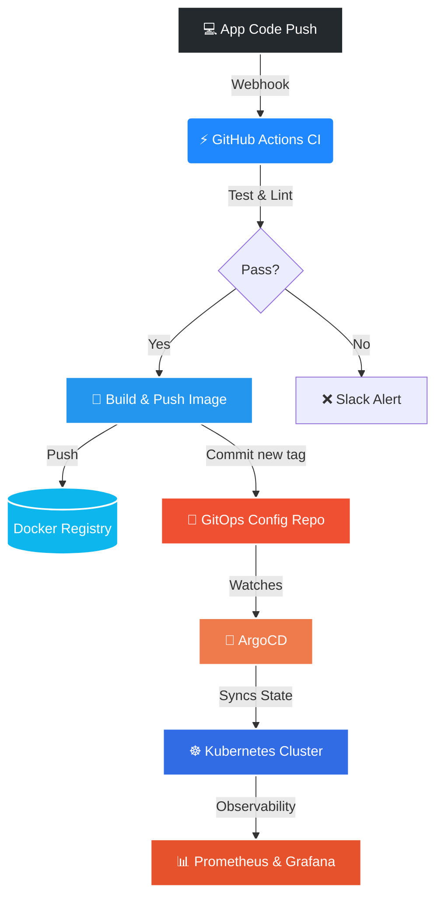

**DevOps Engineer · Cloud Infrastructure Specialist · Automation Enthusiast 🚀**

---

## ♾️ `the_devops_pipeline` (True GitOps Architecture)

I don't just list tools; I engineer automated delivery pipelines. Here is a visual representation of my standard Pull-based GitOps workflow:

---

## ⚙️ `whoami`

I am a DevOps Engineer focused on bridging the gap between development and operations. If there is a manual task, a bottleneck in the software lifecycle, or an unstable server, I write the code to automate, secure, and scale it. 🔧

---

## 🚀 `featured_architecture`

### 🌌 [DevOps Galaxy](https://github.com/k-fathi/REPLACE_WITH_REAL_LINK)
- **Architecture:** Complete CI/CD implementation showcasing automated pipelines.
- **Impact:** Reduced manual deployment steps to a single automated Git trigger.

### 💡 [LUMO & Levi Project](https://github.com/k-fathi/REPLACE_WITH_REAL_LINK)
- **Architecture:** Infrastructure and backend support for a robotic assistant application.
- **Impact:** Ensured high availability and seamless hardware-software integration.

---

## 🏆 `milestones`

- 🎓 **DEPI Round 3** - Intensive DevOps Engineering Program Certificate
- 💼 **HiDeep AI** - Applied technical AI/DevOps skills in a real-world enterprise environment.

---

## 📊 `system_telemetry`

---

## 💬 `ping_me`

